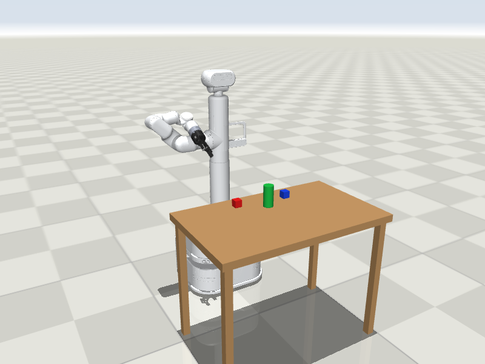
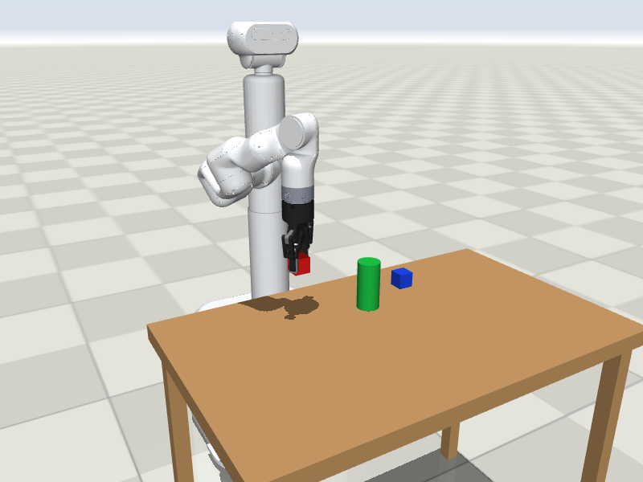
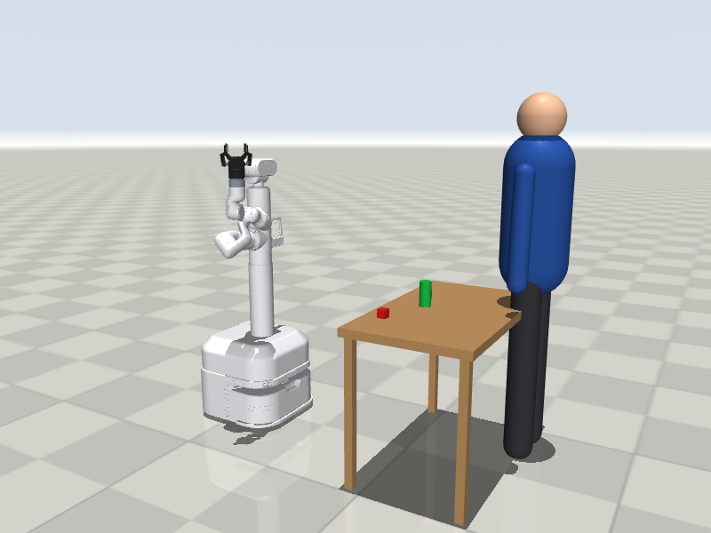
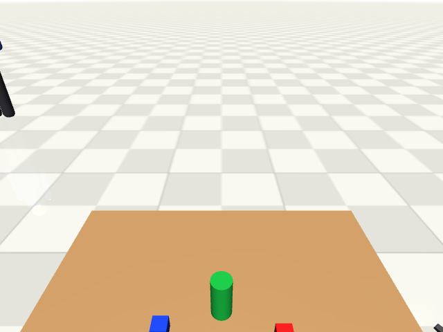

# JAKA Lumi in MuJoCo

A MuJoCo simulation of the **JAKA Lumi** mobile manipulator, controlled through a Python API shaped like the real robot's interfaces. The goal is to develop LLM + vision control in simulation and then run the same code on the real robot.



## The robot

Lumi is a wheeled service robot built for working next to people:

- **Mobile base (AGV):** two driven wheels, drives and turns on the spot
- **Lifting column:** raises the whole upper body by up to 300 mm
- **Waist:** turns the upper body ±140°, so the arm can reach in front, to the side or behind
- **Head:** turns and tilts, and carries a camera; a second camera sits on the torso
- **Arm:** six joints, mounted on the side of the column
- **Gripper:** a two-finger parallel gripper on the end of the arm

With these it can drive up to a table or shelf, look at what is there, pick objects up and put them down somewhere else, and notice and greet a person who walks up to it.

| Pick and place | Waving at a person | Head camera |
|---|---|---|
|  |  |  |

## Done so far

**Robot model**
- Full kinematic chain with real masses and joint limits: base, two wheels, lift, waist, head (2 joints), arm (6 joints), gripper
- 13 actuators: velocity control on the wheels, position control on everything else
- Simplified collision geometry and caster supports, so the robot stands and drives stably
- Head and torso cameras (RGB and depth)
- A test scene: floor, table, two cubes, a can and a movable mannequin standing in for a person

**Python API (`LumiSim`)**
- Body: move lift, waist and head, read their state
- Arm: joint moves, inverse kinematics (waist + 6 arm joints, with collision checking), straight-line moves
- Gripper: open, close, `pick` and `place`
- Base: differential drive with linear and angular speed
- Cameras: RGB and depth images from either camera
- Gesture: wave hello

**Verified by `demo.py` (headless)**

| Check | Result |
|---|---|
| Lift to 150 mm, head pitch 30° | 149.7 mm, 30.0° |
| Pick the red cube | lifted to 0.869 m (table top at 0.75 m) |
| Place it 12 cm to the right | 2 mm from the goal |
| Base: back up 0.4 m, turn left 90° | 0.40 m, 89.2° |
| Person walks up, robot waves | runs; the head camera sees the person |

## Roadmap

| Stage | What | Status |
|---|---|---|
| 1 | Robot model in MuJoCo | done |
| 2 | Python API with the real robot's units and structure | done |
| 3 | Interactive viewer checks and a demo video | next |
| 4 | Perception: find objects and people in the camera image, convert pixels to robot coordinates | planned |
| 5 | LLM vision loop: camera image → LLM → API calls, with a safety layer that checks limits and reach | planned |
| 6 | Make the simulation closer to the hardware: measured speeds and gains, camera parameters, image noise | planned |
| 7 | Real-robot backend (`LumiReal`) with the same methods, calibration, slow first tests on the hardware | planned |
| 8 | Side-by-side video of simulation and real robot | planned |

The detailed step-by-step plan and daily log are in [PLAN.md](PLAN.md) (in Uzbek).

## Run it

```bash
python -m venv venv && source venv/bin/activate
pip install -r requirements.txt

python demo.py               # headless: prints the checks, saves pictures to media/
mjpython demo.py --viewer    # interactive window (macOS needs mjpython)
```

`scene.xml` can also be opened in the MuJoCo app to move every actuator with sliders.

## API

```python
from lumi_api import LumiSim

robot = LumiSim()
robot.body_moveto([150, 0, 0, 30])        # lift mm, waist deg, head yaw deg, head pitch deg
image = robot.get_image("head_cam")       # RGB; depth=True gives meters
robot.pick([0.55, -0.15, 0.77])           # robot frame: x forward, y left, z up (m)
robot.place([0.55, -0.27, 0.77])
robot.drive(0.2, 0.0, 2.0)                # m/s, rad/s, seconds
robot.wave()
```

| Part | Methods | Real robot channel it stands in for |
|---|---|---|
| Lift, waist, head | `body_moveto`, `body_status` | HTTP body-axis API (same units) |
| Arm | `arm_joint_move`, `arm_move_to`, `arm_move_line`, `solve_ik`, `arm_joints`, `tcp_position` | arm controller SDK |
| Gripper | `gripper`, `pick`, `place` | gripper I/O |
| Base | `drive`, `base_pose` | AGV commands |
| Cameras | `get_image` | head and torso cameras |
| Simulation only | `set_person`, `object_position`, `step` | none |

The LLM layer will only ever call these methods. On the real robot a `LumiReal` class with the same methods replaces `LumiSim`, and the rest of the code stays as it is.

## Files

| File | What it is |
|---|---|
| `lumi.xml` | The robot model: bodies, joints, actuators, collision shapes, cameras, gripper |
| `scene.xml` | Floor, table, two cubes, a can and a movable mannequin |
| `lumi_api.py` | `LumiSim`, the Python API |
| `demo.py` | Headless check of body, pick-and-place, base and waving |
| `lumi_description/` | Robot description and meshes |
| `robotiq_2f85/` | Gripper model |
| `assets/` | Arm "JAKA" labels: texture and curved meshes |
| `tools/make_decals.py` | Rebuilds the files in `assets/` (`python3 tools/make_decals.py`, needs Pillow) |
| `PLAN.md` | Project plan and daily log |

## Simulation versus the real robot

- **Matches the robot:** link geometry, joint axes, masses, joint limits (lift 0–300 mm, waist ±140°).
- **Estimated, to be measured on the hardware:** actuator gains and force limits, joint speeds, camera positions and field of view.
- **Simplified:** gravity compensation is switched on for the column and arm, the caster wheels are frictionless spheres, and the base and head collide as boxes and cylinders.
- **Workspace:** the arm is short and mounted on the robot's right side, so reaching in front needs the waist to turn; `arm_move_to` does this and counter-rotates the head. Top-down grasps work out to roughly 0.6 m in front of the wheel axle.
